# Project 1 Planning: The Unofficial Guide

> Write this document before you write any pipeline code.
> Your spec and architecture diagram are what you'll use to direct AI tools (Claude, Copilot, etc.) to generate your implementation — the more specific they are, the more useful the generated code will be.
> Update the Retrieval Approach and Chunking Strategy sections if you change your approach during implementation.
> Update this file before starting any stretch features.

---

## Domain

<!-- What domain did you choose? Why is this knowledge valuable and hard to find through official channels? -->
## Domain
Student reviews of CS professors at the University of Toronto (UofT). 
This knowledge is valuable because official university channels only provide 
formal course descriptions and instructor bios — they don't capture real student 
experiences like teaching quality, exam difficulty, office hour availability, or 
which professors to avoid. Students rely on informal sources like Reddit and Rate 
My Professors to make course selection decisions.

---

## Documents

<!-- List your specific sources: URLs, subreddit names, forum threads, or file descriptions.
     Aim for at least 10 sources that together cover different subtopics or perspectives within your domain. -->

| # | Source | Description | URL or location |
|---|--------|-------------|-----------------|
| 1 | | | |
| 2 | | | |
| 3 | | | |
| 4 | | | |
| 5 | | | |
| 6 | | | |
| 7 | | | |
| 8 | | | |
| 9 | | | |
| 10 | | | |

---
| # | Source | Description | URL or location |
|---|--------|-------------|-----------------|
| 1 | Rate My Professors | CS professor reviews | https://www.ratemyprofessors.com/professor/1694041 |
| 2 | Rate My Professors | CS professor reviews | https://www.ratemyprofessors.com/professor/3121445 |
| 3 | Rate My Professors | CS professor reviews | https://www.ratemyprofessors.com/professor/2340488 |
| 4 | Rate My Professors | CS professor reviews | https://www.ratemyprofessors.com/professor/20260 |
| 5 | Rate My Professors | CS professor reviews | https://www.ratemyprofessors.com/professor/1443534 |
| 6 | Rate My Professors | CS professor reviews | https://www.ratemyprofessors.com/professor/3118690 |
| 7 | Rate My Professors | CS professor reviews | https://www.ratemyprofessors.com/professor/2127391 |
| 8 | Rate My Professors | CS professor reviews | https://www.ratemyprofessors.com/professor/30803 |
| 9 | Rate My Professors | CS professor reviews | https://www.ratemyprofessors.com/professor/30200 |
| 10 | Rate My Professors | CS professor reviews | https://www.ratemyprofessors.com/professor/69474 |
| 11 | Rate My Professors | CS professor reviews | https://www.ratemyprofessors.com/professor/3042719 |
| 12 | Reddit r/UofT | Student professor review thread | https://www.reddit.com/r/UofT/comments/n7h98q/help_others_by_submitting_a_review_for_all_your/ |
| 13 | Reddit r/UofT | CSC 300/400 course suggestions | https://www.reddit.com/r/UofT/comments/1tirtnu/any_suggestions_on_what_csc_300400_level_courses/ |
| 14 | Reddit r/UofT | Finding grad CS professors | https://www.reddit.com/r/UofT/comments/1ouc9zd/finding_professors_to_work_with_for_graduate/ |
| 15 | Reddit r/UofT | Avoid CSC401 warning | https://www.reddit.com/r/UofT/comments/11qau12/avoid_csc401_im_even_not_kidding/ |
| 16 | Reddit r/UofT | Rating every course at UofT | https://www.reddit.com/r/UofT/comments/1kjq8ji/rating_and_reviewing_every_course_i_took_at_uoft/ |
| 17 | Reddit r/UofT | Best instructor at UofT | https://www.reddit.com/r/UofT/comments/2u8ral/u_of_t_redditors_whos_the_best_instructor_you_had/ |
| 18 | Reddit r/UofT | Best profs for CSC148/165 | https://www.reddit.com/r/UofT/comments/7kelyu/best_profs_for_csc148165/ |
| 19 | Reddit r/UofT | UTSC CS 1st year best professors | https://www.reddit.com/r/UofT/comments/4rdqw7/utsc_cs_1st_year_who_are_the_best_professors/ |
| 20 | Reddit r/UofT | CompSci first year best profs | https://www.reddit.com/r/UofT/comments/1ed0ww/comp_sci_first_year_at_utsg_best_profs_best/ |
| 21 | Reddit r/UofT | Best profs for math and CS | https://www.reddit.com/r/UofT/comments/1e0xd39/what_professors_are_the_best_at_utsg_for_math_and/ |

## Chunking Strategy

<!-- How will you split documents into chunks?
     State your chunk size (in tokens or characters), overlap size, and explain why those
     numbers fit the structure of your documents.
     A review-heavy corpus warrants different chunking than a long FAQ. -->

**Chunk size:** 500

**Overlap:** 50

#Q- If a key fact spans two adjacent chunks, will either chunk be retrievable on its own? What does overlap help with?
**Reasoning:** Reddit posts are long and therefore would like capture one entire concept into one chunk as much as possible. More sophistication is possible, including different chunking strategies for different source groups, but given the timeline available for me to complete the project, I will revert to a simplified version. That is one chunking strategy to utilize for all sources. General rule of thumb is 10-20% should be the overlap so that context is not lost mid sentence. Here we are taking 50 mostly as a safety measure as text are short conversations generally and not information dense generally. Typical conversation is one about one professor, one conversation, no sequence to be maintained. For Rate my professor a shorter chunk size would also work, but we are trying to get one best option. If the chunk size was overly large like 2000, it would consume multiple conversation into a chunk

Pros of this method: simpler code, easier to debug, faster delivery
Cons of this method: optimal chunking size per source type. 

Guiding principle:
#Precision: get exactly what you are looking for (without garbage) — out of what you retrieved, how much was relevant?
#Recall: get everything that was relevant (do not miss anything)
#Context Window: is the maximum amount of text a model can see at one time. (Think of it like a model's working memory. Everything inside the window — the system prompt, conversation history, retrieved chunks, user question — the model can reason over. Everything outside it, the model simply cannot see. It doesn't exist.)
Every model has a fixed limit measured in tokens (roughly 1 token ≈ 4 characters)

#QHow would you know if your chunks are too small? Too large? What would bad retrieval results look like in each case?
#Triangle mnemonic:
1. Too Narrow : Precision high, Recall low  = high precision with low garbage,  but incomplete answers/split thoughts 
2. Sweet spot : Precision high, Recall high = focused on one concept, complete thought captured
3. Too Wide   : Precision low,  Recall high = garbage noise from mixed topics/ precision is low, nothing gets missed, answers feel muddy and unfocused. Also the vector distance will be neither close to concept 1 or 2, rather have a larger distance from both. 

1. context window is under no pressure but does not provide complete information
2. context window is balanced and information is useful
3. context window is under pressure and vague outputs

#Q: Are your documents short reviews (1–3 sentences) or long guides (many paragraphs)? How does that affect the right chunk size?
#Principle to remember:
Match your chunking architecture to the natural structure of your documents
1. Reviews and comments → flat, single level, small chunks
2. Long articles and FAQs → medium chunks with overlap
3. Novels, textbooks, legal documents → hierarchical, multiple levels aka Sweet Spot + Chapter Summaries + Full Book Summary
---

## Retrieval Approach

<!-- Which embedding model are you using (e.g., all-MiniLM-L6-v2 via sentence-transformers)? : 
     How many chunks will you retrieve per query (top-k)?
     If you were deploying this for real users and cost wasn't a constraint, what tradeoffs
     would you weigh in choosing a different embedding model — context length, multilingual
     support, accuracy on domain-specific text, latency? -->

**Embedding model:** all-MiniLM-L6-v2 via sentence-transformers

**Top-k:**start with 5 and tune during evaluation

**Production tradeoff reflection:**
all-MiniLM-L6-v2 is fast, free and runs locally - ideal for our project

#Domain Specific: 
text-embedding-3-large is a larger more accurate general model for embedding and may be evaluated for higher baseline accuracy.
instructor-xl can be prompted, and prepended to the chunk as a list pair. 
in Instructor-xl, we pass two things = Instructions + chunk, together as a pair 

embedding = model.encode([
#"Represent student reviews of CS professors at University of Toronto",
"...<Chunk...here> .... Prof A is a great lecturer, explains subject clearly"
])

when a question is asked
embedding = model.encode([
#"Represent a students question about CS professors at University of Toronto",
"...<Chunk...here> .... is Prof A is a good lecturer?"
])
Caveat: instructions for the query are slightly different. This helps the model align the chunks correctly in vector space. 
It tells the embedding model what kind of meaning to focus on when it converts the chunk to numbers, nothing more. 

Multiligual support:
If needed (based on international students and other sources of communication where different languages may be used), mutiligual-e-5-large may be evaluated. Based on how much value it provides to the overall objective it may be considered, however reponse times will be slower. 

Context lenght:
all-MiniLM has 256 tokens per chunk, which is sufficient for us. if chunking strategy changes to larger chunks, a model with longer context like text-embedding-3-large (8191 tokens) would be necessary. 
At our 500 characters chunk ~ 125 tokens are needed for each chunk which is within the limits of all-MiniLM's 256 token limit.
If our chunk was resized to 1000 characters ~ 250 tokens, not we are risking truncation. This would be a silent error (the worst kind). For such as situation, we would need to move towards text-embedding-3-large with 8k tokens. 

Latency vs Accuracy: all-MiniLM is extremely fast but sacrifices some accuracy. For RT student interfact, that is acceptable.
However, if accuracy is more important, then we may prefer a slower larger model like text-embed-3-large. 

Fine-tuning is not warranted here - RAG provides domain knowledge. 

---

## Evaluation Plan

<!-- List your 5 test questions with their expected correct answers.
     Questions should be specific enough that you can judge whether the system's response
     is right or wrong. "What are good dining halls?" is too vague.
     "What do students say about wait times at [dining hall name] during lunch?" is testable. -->

| # | Question | Expected answer |Source
|---|----------|-----------------|
| 1 |"how is professor Geoffrey Hinton?" | "he is a wonderful professor" , he is a well respected professor", "rock star" |https://www.ratemyprofessors.com/professor/1694041
| 2 |"how was your experience taking CSC401 class for 2023?" |"lack of reponse and opaque evaluations with negative sentiment" |https://www.reddit.com/r/UofT/comments/11qau12/avoid_csc401_im_even_not_kidding/
| 3 |"who is the professor for CSCA08H3?" | "Brian Harrington"|https://www.reddit.com/r/UofT/comments/4rdqw7/utsc_cs_1st_year_who_are_the_best_professors/
| 4 |"which professor is better Kathleen Smith or Moore"  |"Kathleen Smith" |https://www.reddit.com/r/UofT/comments/4rdqw7/utsc_cs_1st_year_who_are_the_best_professors/
| 5 |"where can post about a lost dog?" |"Sorry, I do not have the answer" |

---

## Anticipated Challenges

<!-- What could go wrong? Name at least two specific risks with reasoning.
     Consider: noisy or inconsistent documents, missing source attribution, off-topic
     retrieval, chunks that split key information across boundaries. -->

1. Reddit relies heavily on implied context and community short hand. Conversations are related, however the reference may only be understood as implied or tribal knowledge and hard for LLM to connect. Community nicknames or abbreviations (eg. 'recurssion guy' , or 'CSS108 TA') may not resolve to a real professor name, making retrieval and attribution impossible. Also when chunked at comment level, the replies become orphans and lose their meaning in isolation, contributing nothing to the answer. 

2. Both precision and recall will suffer. Even on the same topic, context is typically in the header of the thread followed by experiences that may not always logically link back to the topic in conversation directly other than sequential replies. Thread structure is the most important information. Similar named first names can easily be mixed or confused within conversation although the header of the conversation may be calling out the complete professor name or subject taught as context. Precision drops because orphaned replies with generic responses for any professor query without adding useful information. Recall dops because key facts - professor name, course code, opinions are split across multiple chunks in threat, meaning no single chunk contains the complete answer. 

3. Rate my professor may have stale data or reviews may be updated since the time it was last scraped and embedded. Outdate data about a professor who has left or changed positions may not captured. Without timestamp on chunks, the model can not distinguish a 5 year old review from a recent one, and has no basis for prioritizing current information. 

Resolution: The underlying problem is that thread structure does not survive the chunking at the comment level. The solution in production would be to prepend the thread title and original post to every reply chunk before embedding so each chunk carries its own context. Any one word or emoticon only replies may be excluded. If the title and original post is extremely long, may consider a larger embedding model based on token size requirements.   
---

## Architecture

<!-- Draw a diagram of your pipeline showing the five stages:
     Document Ingestion → Chunking → Embedding + Vector Store → Retrieval → Generation
     Label each stage with the tool or library you're using.
     You can use ASCII art, a Mermaid diagram, or embed a sketch as an image.
     You'll use this diagram as context when prompting AI tools to implement each stage. -->

---

## AI Tool Plan

<!-- For each part of the pipeline below, describe:
     - Which AI tool you plan to use (Claude, Copilot, ChatGPT, etc.)
     - What you'll give it as input (which sections of this planning.md, which requirements)
     - What you expect it to produce
     - How you'll verify the output matches your spec

     "I'll use AI to help me code" is not a plan.
     "I'll give Claude my Chunking Strategy section and ask it to implement chunk_text()
     with my specified chunk size and overlap" is a plan. -->

**Milestone 3 — Ingestion and chunking:**

**Milestone 4 — Embedding and retrieval:**

**Milestone 5 — Generation and interface:**

```mermaid
flowchart TD
    A[Planning.md Chunking Strategy section] --> B[Claude: implement chunk_text\n500 chars 50 overlap\nsplit at sentence boundaries]
    B --> C[Verify: print chunks\ncheck no mid-sentence splits\ncheck length within limits]

    D[Planning.md Retrieval Approach section] --> E[Claude: implement embed_chunks\nall-MiniLM-L6-v2 sentence-transformers\nstore in ChromaDB]
    E --> F[Verify: query vector store\nconfirm top-5 chunks returned\nmake sense for test question]

    G[Planning.md Architecture and Evaluation Plan] --> H[Claude: implement generate_response\nClaude Haiku via Anthropic API\nsystem prompt + chunks + query]
    H --> I[Verify: run 5 test questions\ncheck answers match\nexpected answers]

    subgraph M3[Milestone 3 — Ingestion and Chunking]
        A
        B
        C
    end

    subgraph M4[Milestone 4 — Embedding and Retrieval]
        D
        E
        F
    end

    subgraph M5[Milestone 5 — Generation and Interface]
        G
        H
        I
    end
```

